# Framer-Animations-for-10-Mobile-Interaction-Situations

Animation is fast becoming a common element of interface design. But understanding how animations serve to improve the functions of graphical user interfaces, and not distract from them is not always clear.

As a UX designer who is very interested in motion design, I decided to explore the topic of making animation for user interface, hoping it can bring useful ideas to designers.

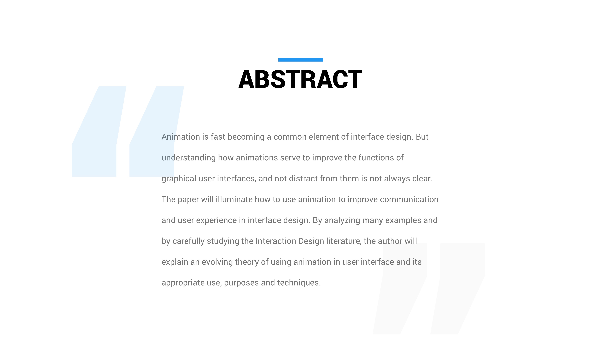

## SITUATION 1: Banner

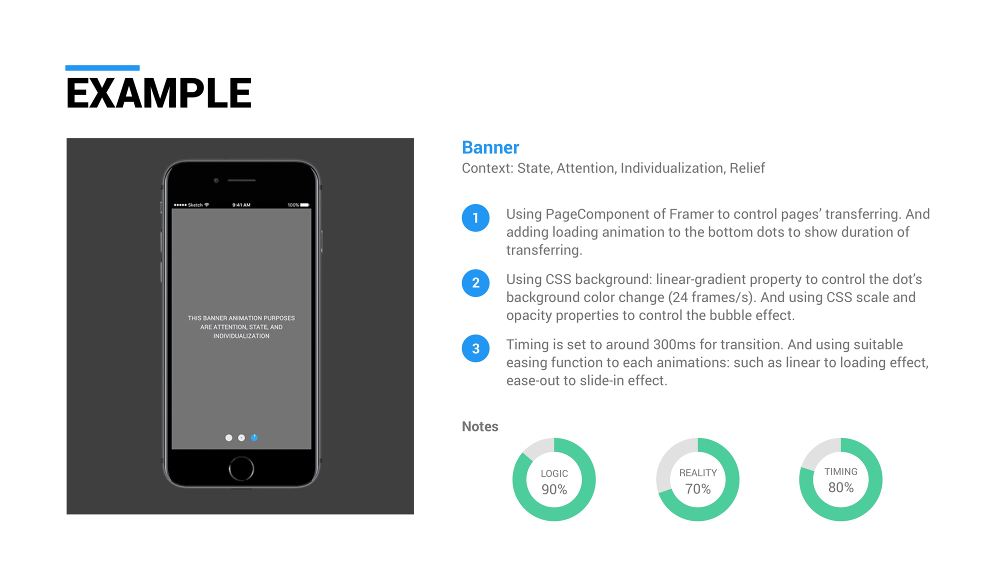
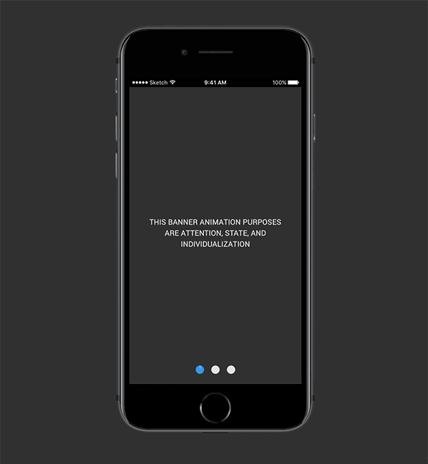

## SITUATION 2: Form

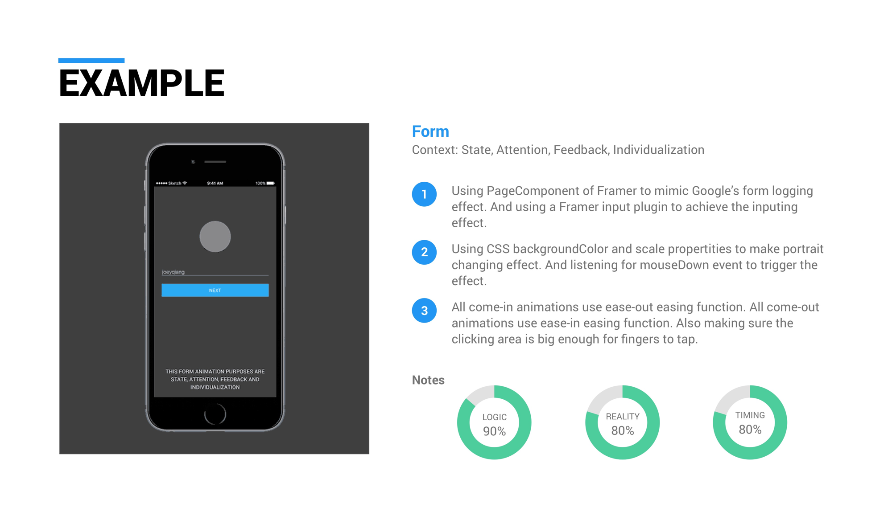
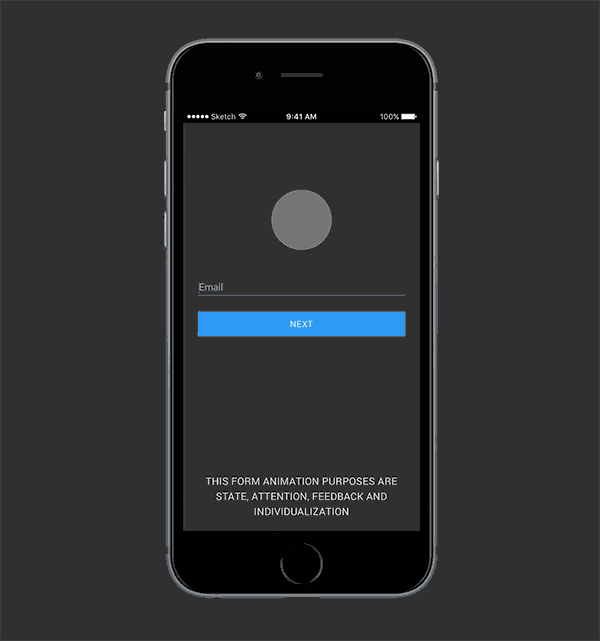

## SITUATION 3: Stage

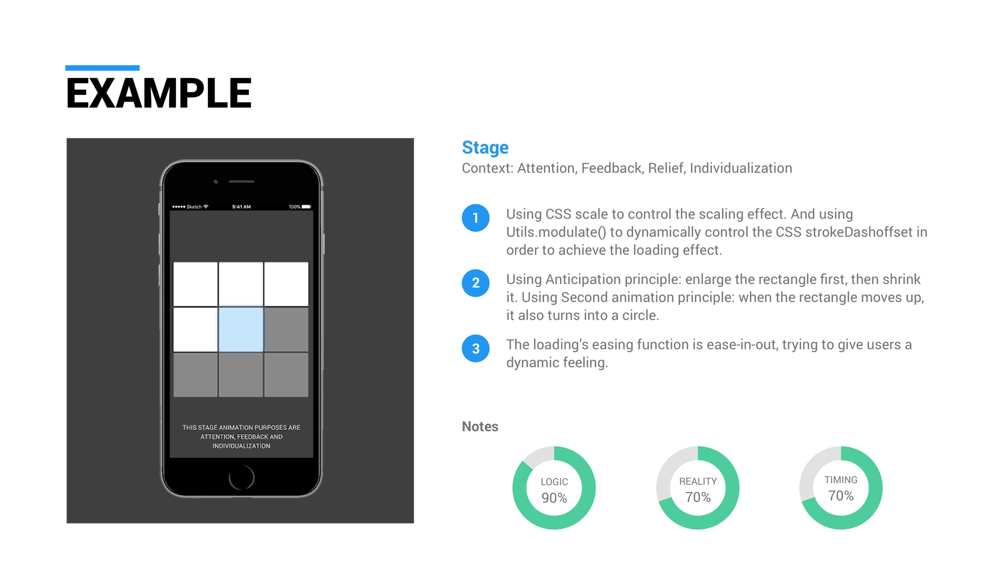

## SITUATION 4: Menu

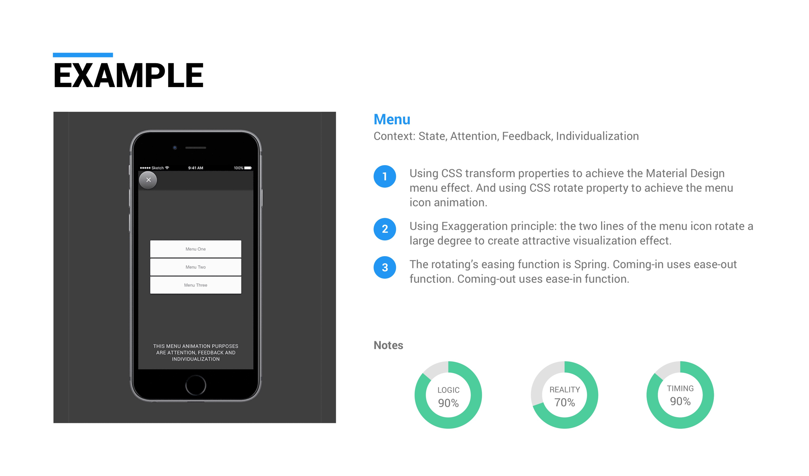
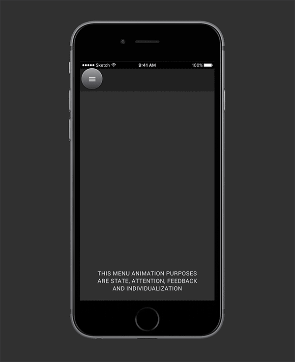

## SITUATION 5: Transition

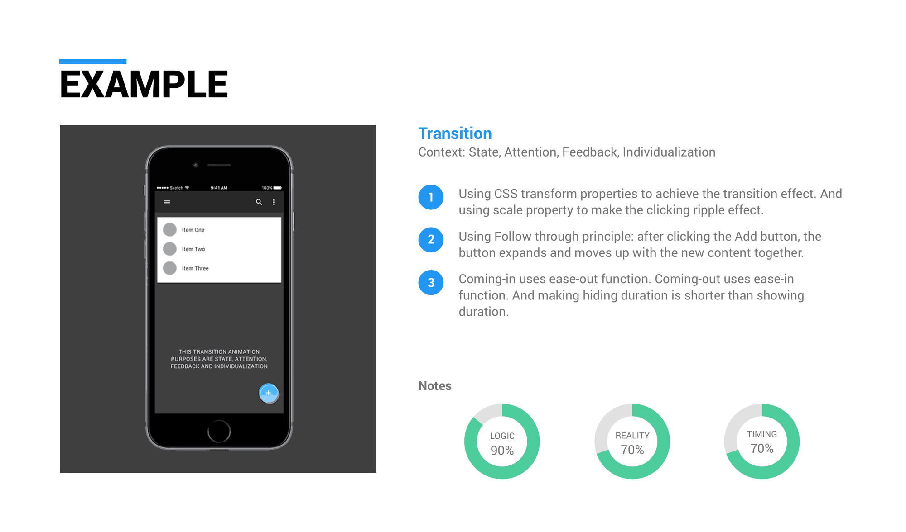
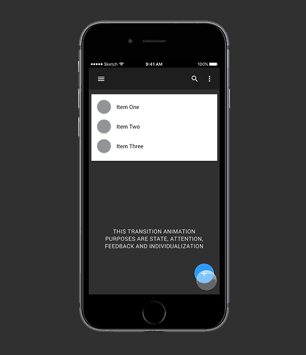

## SITUATION 6: Background

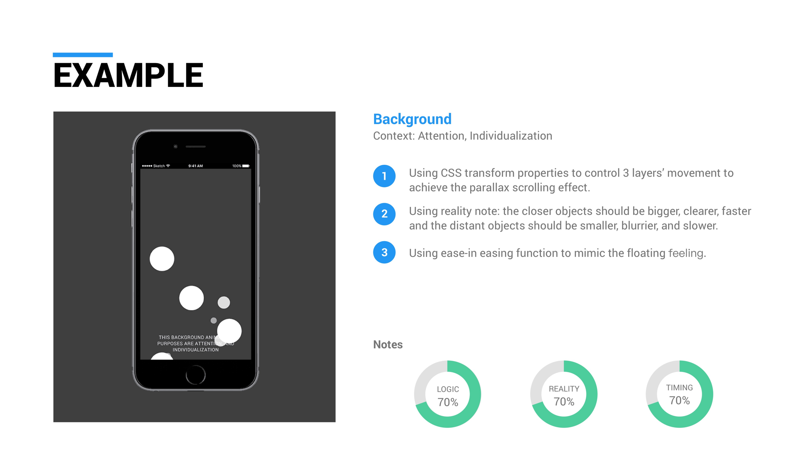
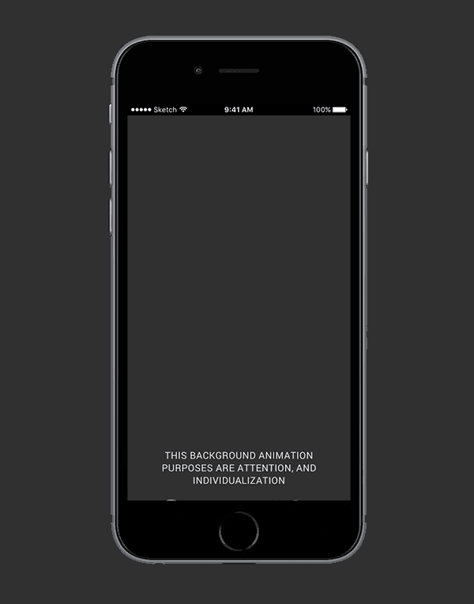

## SITUATION 7: Loading

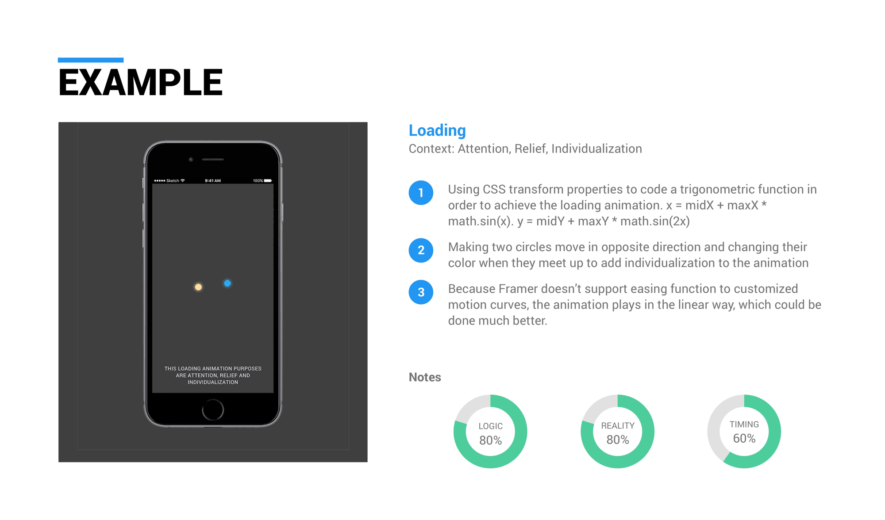
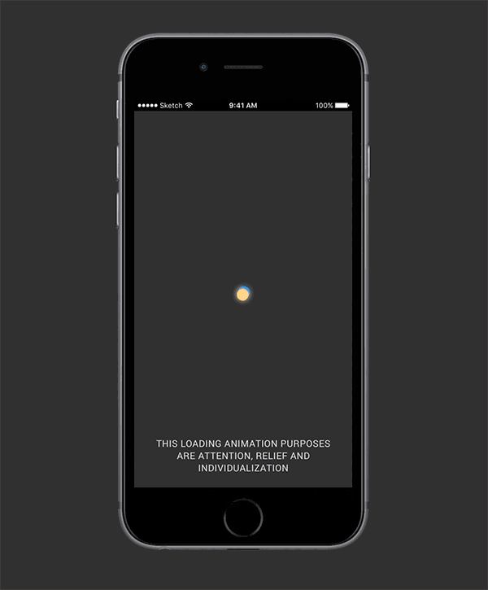

## SITUATION 8: Scrolling

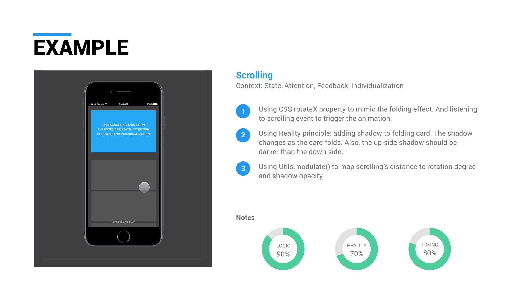
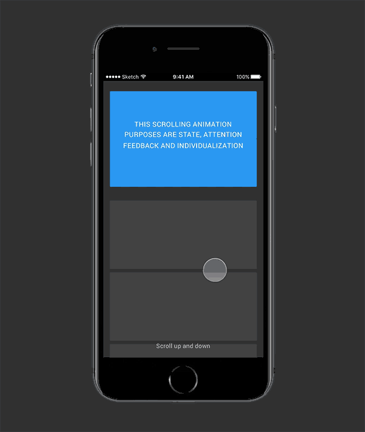

## SITUATION 9: Hover

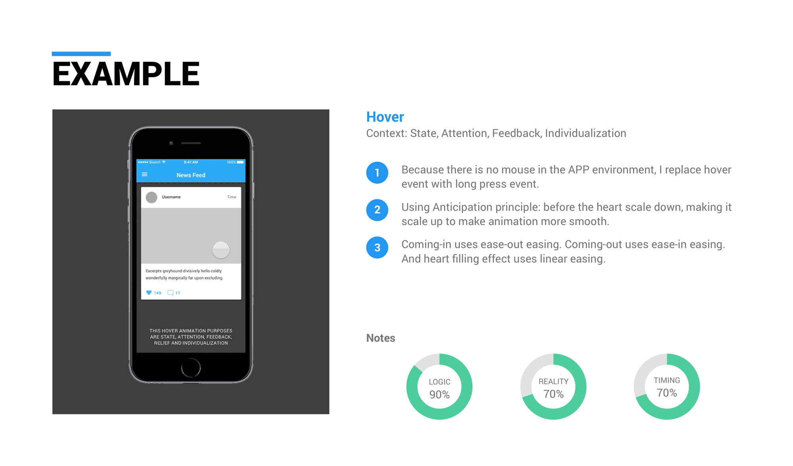
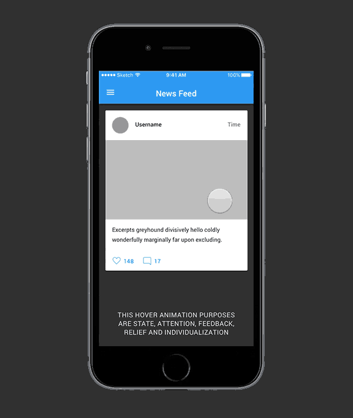

## SITUATION 10: Image

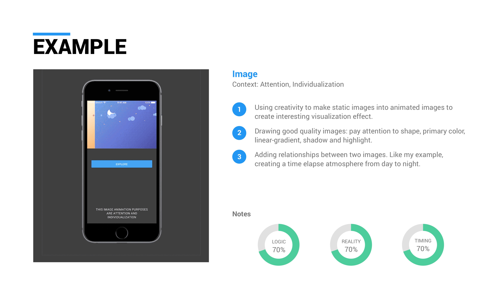
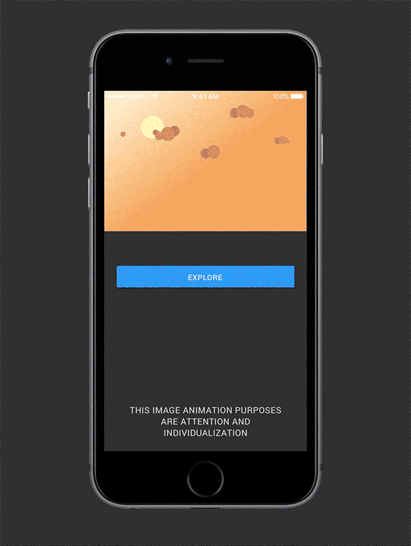

Thank you for reading. For design details, please visit my [Medium blog](https://medium.com/@JoeyQiang/the-animated-interface-a-user-experience-perspective-on-best-practices-in-ui-design-4520f024b801)
