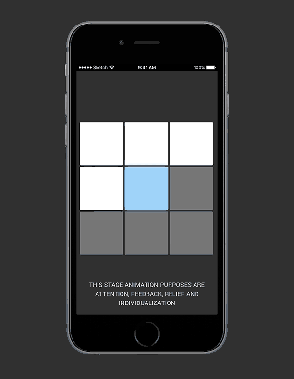

# Framer-Animations-for-10-Mobile-Interaction-Situations
The 10 animations are purposely created for 10 frequent mobile interaction situations

**SITUATION 1: Banner**

**SITUATION 2: Form**

**SITUATION 3: Stage**

**SITUATION 4: Menu**

**SITUATION 5: Transition**

**SITUATION 6: Background**

**SITUATION 7: Loading**

**SITUATION 8: Scrolling**

**SITUATION 9: Hover**

**SITUATION 10: Image**

Enjoy it! Thank you for reading.
